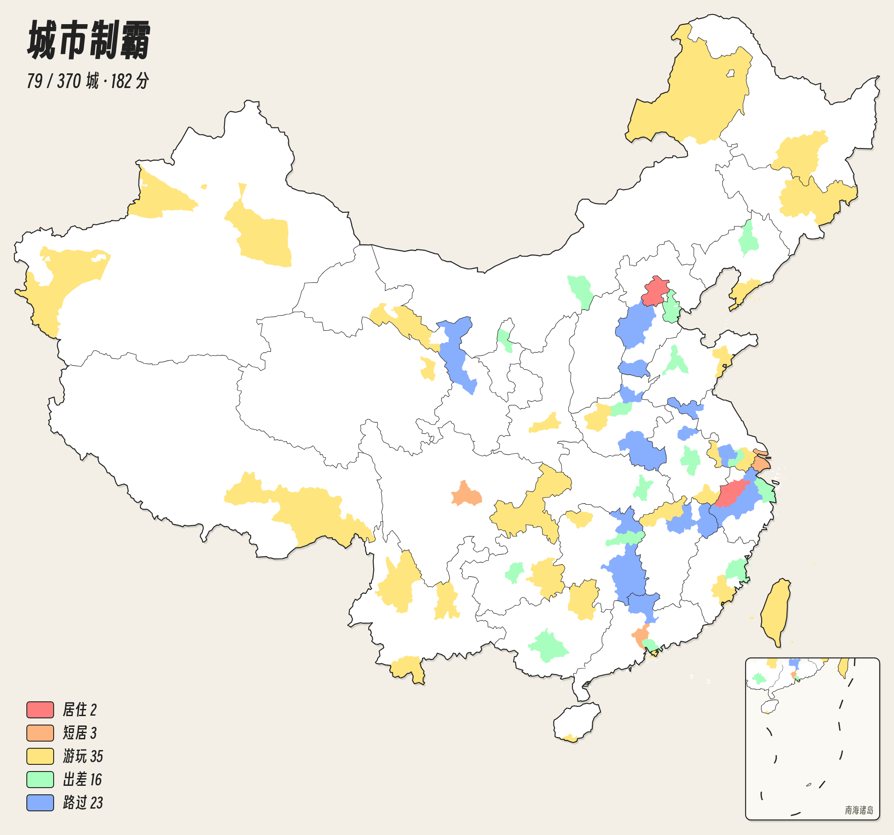

# 城市制霸

标记你去过的每一座中国城市，生成属于你的城市足迹地图。

**在线使用：[china.loveyou.moe](https://china.loveyou.moe)**

## 功能

- **370 座城市**：覆盖全部地级市、自治州、地区、盟，以及省直辖的县级市和京津沪渝港澳台，共 370 个单位。
- **两级地图**：全国视图点击省份，地图平滑放大到该省，逐市标记；点邻省直接切换，点海面或按返回键回到全国。
- **五个等级**：居住、短居、游玩、出差、路过，每个城市一种颜色，自动统计总分和各等级数量。
- **画笔**：在省视图选中一个等级，连续点击城市即可快速涂色。
- **搜索定位**：输入城市名或简称，直接飞到该城市并弹出标记菜单；也可以按大区浏览省份、再选城市。
- **自由缩放**：支持鼠标滚轮、触控板捏合、手机双指缩放和拖动平移。
- **保存图片**：一键导出分享图，带标题、分数与图例。
- **数据备份**：数据自动保存在浏览器中；也可以导出为 JSON 文件，本地编辑后再导入，支持与现有数据合并或替换。
- **手机友好**：自适应手机和电脑布局；微信等内置浏览器中同样可以保存图片和导出数据。
- **键盘可用**：全部操作都可以用键盘完成，并遵循系统的"减少动态效果"设置。

灵感来自 [itorr/china-ex](https://github.com/itorr/china-ex)。代码以 [MIT](LICENSE) 许可证开源。
