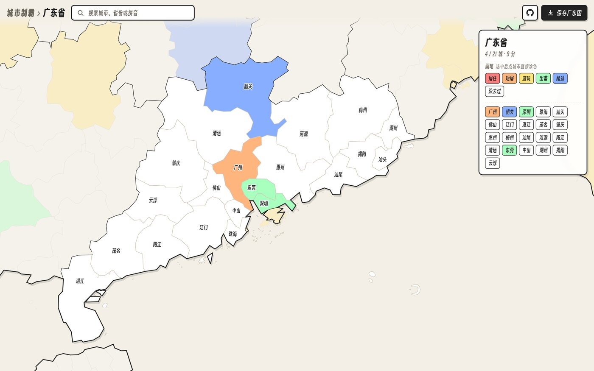
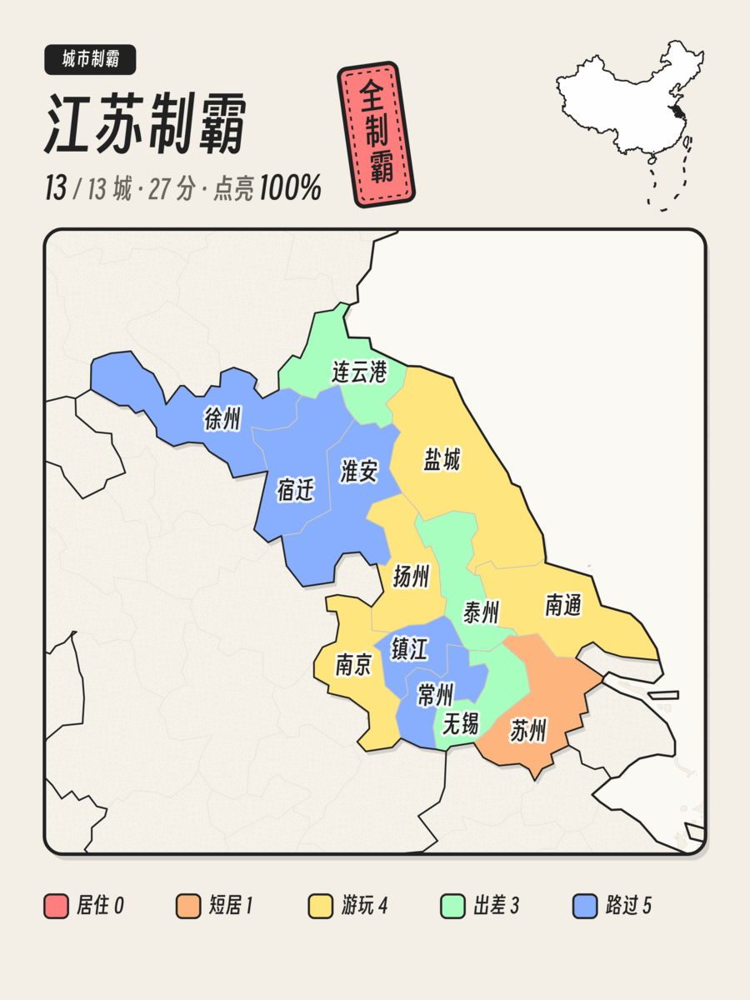

# 城市制霸

标记你去过的每一座中国城市，生成属于你的城市足迹地图。

**在线使用：[china.loveyou.moe](https://china.loveyou.moe)**

## 功能

### 全国 ⇄ 省，两级地图

全国视图点击省份，地图平滑放大到该省，给每个城市标记等级；点邻省直接切换，点海面或按返回键回到全国。支持滚轮、触控板和双指缩放。

### 五个等级

| 等级 | 含义 |
|---|---|
| 居住 | 住过一年以上 |
| 短居 | 住过一个月以上 |
| 游玩 | 旅行过 |
| 出差 | 去过但没怎么玩 |
| 路过 | 路过或经停 |

每个城市按等级上色，自动统计总分和各等级数量。省视图里还可以用"画笔"选好等级后连续点击，快速涂完一个省。

### 保存分享图

- **全国视图**：导出全国足迹图（见页首）。
- **省视图**：导出该省的"XX制霸"竖图，标出每个城市的名字；全省点亮会盖上"全制霸"印章。

### 数据保存

标记数据只保存在你自己的浏览器里，不上传任何服务器。换设备或清理浏览器数据前，可以先导出为 JSON 文件备份，之后再导入恢复。

## 370 座城市是怎么算的

这里的"城市"指**地级行政区**，以及与地级同样被视为一个"地方"的单位，按民政部行政区划划分，共 370 个：

| 类别 | 数量 | 说明 |
|---|---|---|
| 地级市 | 293 | 如杭州、苏州、三沙 |
| 自治州 | 30 | 如延边、大理、伊犁 |
| 地区 | 7 | 大兴安岭、阿里、阿克苏、喀什、和田、塔城、阿勒泰 |
| 盟 | 3 | 兴安盟、锡林郭勒盟、阿拉善盟 |
| **以上合计：地级行政区** | **333** | |
| 省直辖县级单位 | 30 | 不属于任何地级市，单独计入：河南济源；湖北仙桃、潜江、天门、神农架林区；海南五指山、琼海、文昌、万宁、东方及定安、屯昌、澄迈、临高、白沙、昌江、乐东、陵水、保亭、琼中；新疆兵团 10 市（石河子、阿拉尔、图木舒克、五家渠、北屯、铁门关、双河、可克达拉、昆玉、胡杨河） |
| 直辖市、特别行政区、台湾 | 7 | 北京、天津、上海、重庆、香港、澳门、台湾各算一个，不再细分到区县 |
| **总计** | **370** | |

需要注意：

- **县级市不单独计算**：如昆山、义乌、张家港，分别属于苏州、金华、苏州，标记所在的地级市即可。
- **直辖市不细分区县**：去过北京任何一个区，都算去过北京。
- **行政区划以数据采集时为准**：边界数据来自阿里 DataV GeoAtlas，行政区划此后如有调整，会在后续更新中同步。

## 其他

灵感来自 [itorr/china-ex](https://github.com/itorr/china-ex)。代码以 [MIT](LICENSE) 许可证开源，字体与地图数据的授权见 [NOTICE](NOTICE)。
